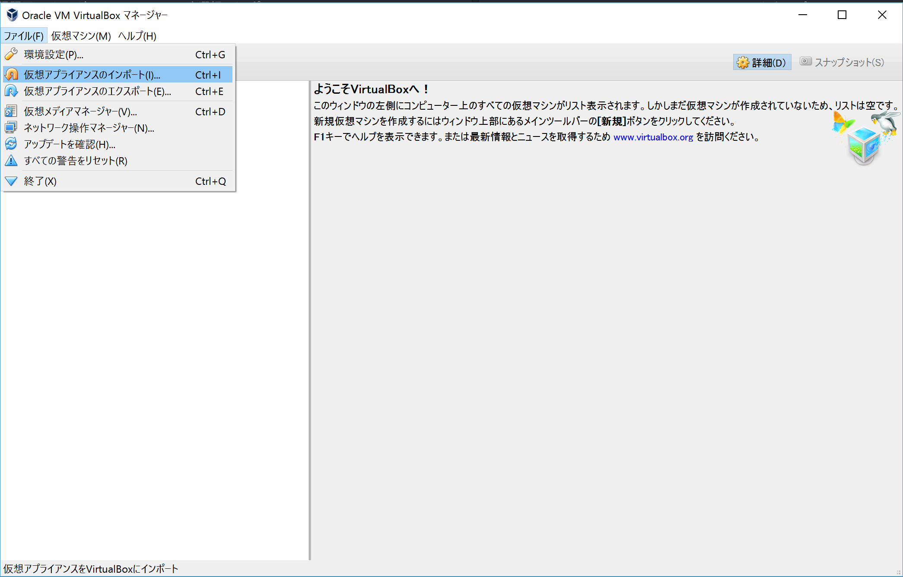
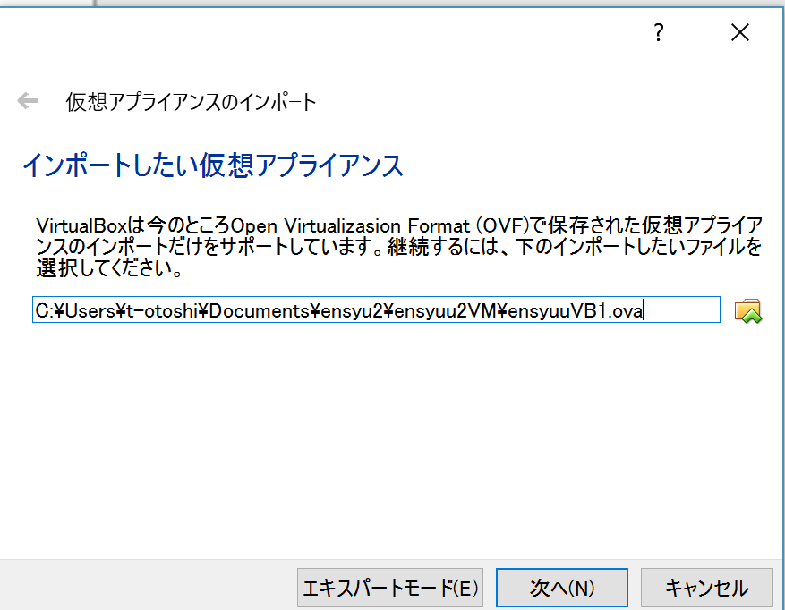
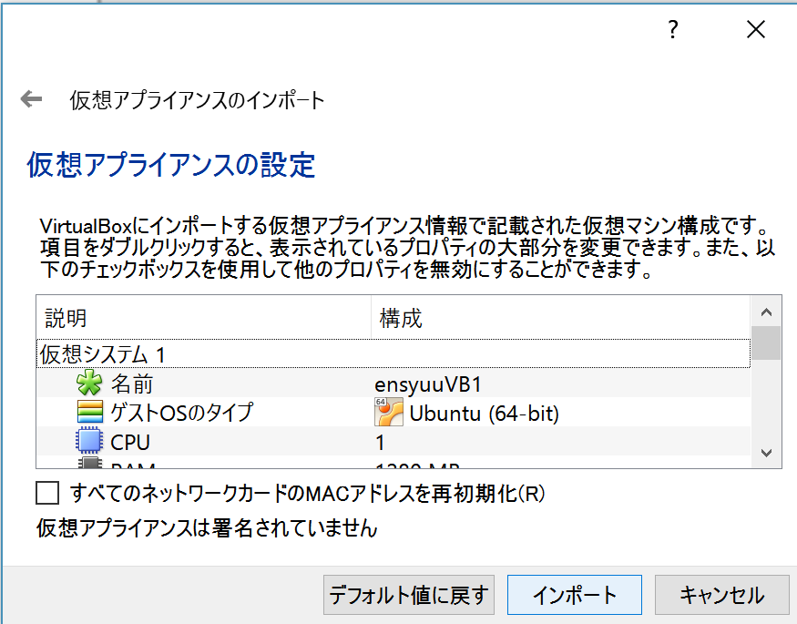
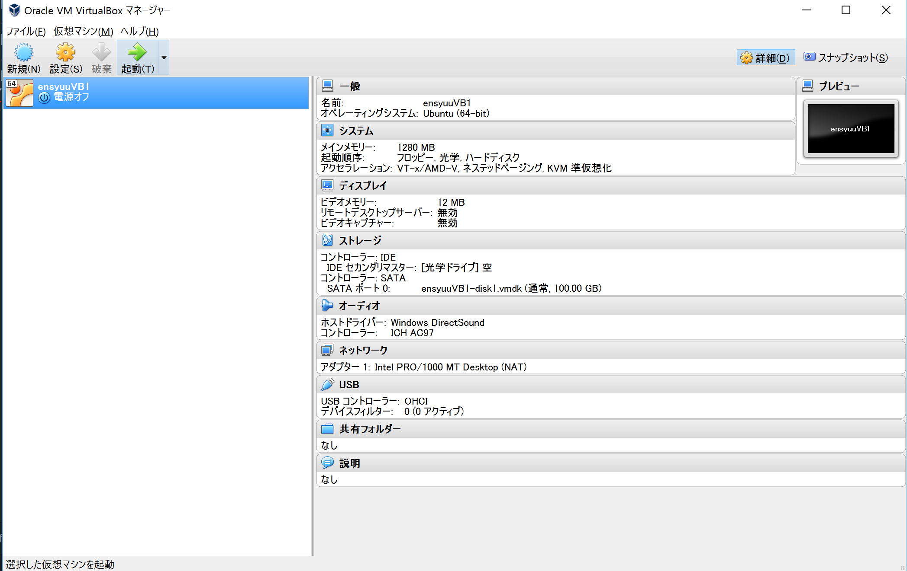
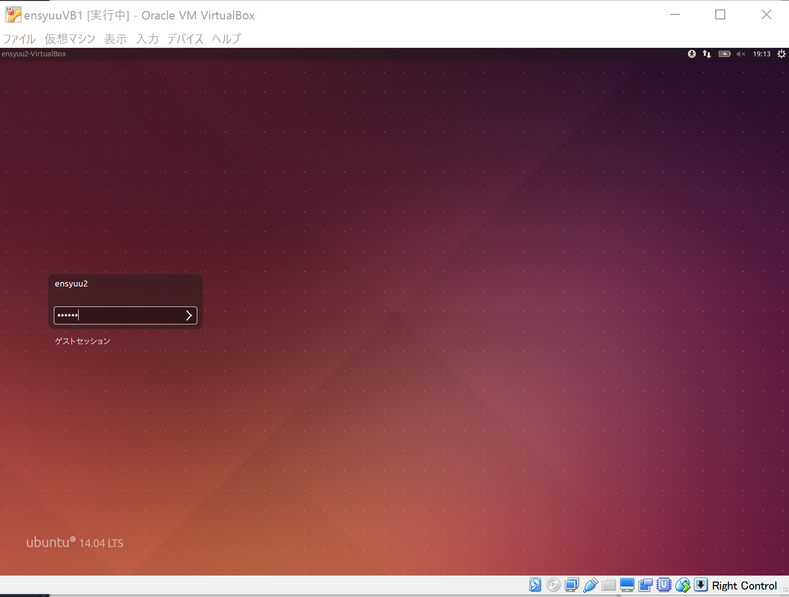

# 課題用VMの使い方
* [VirtualBox](https://www.virtualbox.org/)をインストール
* 課題用VMイメージをVirtualBoxにインポート
  1. [課題用VMイメージ](http://www.ane.cmc.osaka-u.ac.jp/~hasegawa/2016-ein2/ensyuuVB1.ova)(約3GB)をダウンロード
  2. VirtualBoxのメニュー → ファイル → 仮想アプライアンスのインポート
  
  3. 課題用VMイメージ(ensyuuVB1.ova)を選択して「次へ」
  
  4. 「インポート」をクリック
  
* インポートしたVMイメージを起動
  1. VirtualBoxでensyuuVB1を選択して「起動」をクリック
  
  2. ubuntuが立ち上がるのでログイン
    * ユーザー名、パスワードは共に'ensyuu2'
  
